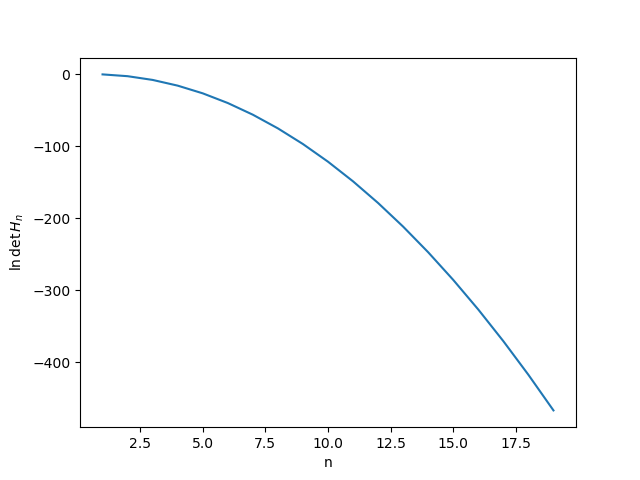
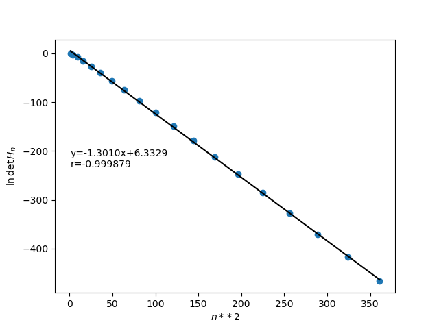
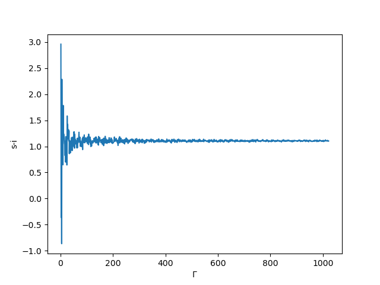
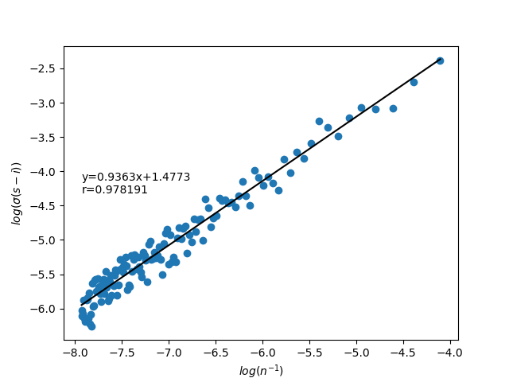

[问题](./%E7%AC%AC%E4%B8%80%E6%AC%A1%E4%BD%9C%E4%B8%9A.pdf)
[解答](./%E7%AC%AC%E4%B8%80%E6%AC%A1%E4%BD%9C%E4%B8%9A%E8%A7%A3%E7%AD%94.pdf)
# 1.三种方法计算$e^{-x}$
### 直接计算

这种方法的稳定性最差。可以预料，当$x,n$不断增大时，$x^n$与$n!$会溢出
### 递归法
计算方式为 $s_n = s_{n-1}\times (-1)x/n,\ s_0=1$ ，于是
$$
T=e^{-x}= \sum_{n=0}^{\infty} (-1)^n \frac{x^n}{n!} =\sum_{n=0}^\infty s_n
$$
中间项$s_n$的变化规律是：$s_n$的符号不断震荡，其绝对值在$n<x$时递增，$n>x$时递减并趋向0.
设我们取前n+1项$T_n = \sum_{k=0}^n s_k$作为$e^{-x}$的一个估计，则根据taylor展开的余项公式，有
$$
T =T_n + f^{(n+1)}(\xi)\frac{(-1)^{n+1}x^{n+1}}{(n+1)!}\ (\xi\in (0,x)) 
$$
可以看到，$T_n$中每一项都是正负交错的，这导致级数的收敛很慢。
考察余项：
$$
|e^{-x}-T_n| = \frac{e^{-\xi}x^{n+1}}{(n+1)!}<\frac{x^{n+1}}{(n+1)!}\overset{n>>1}{\sim}(\frac{ex}{n})^n 
$$
其中用到了Stirling公式：$n!\sim n^ne^{-n}\sqrt{2\pi n}$。
当$x<n/e$时$ex/n<1$，此时估计值更接近。
从实际计算结果中来看，$maxn=100$,$x<100/e=36.78$ 但$x$从大约17开始就与真值之间有很大偏差了。这是因为$n$小时，各个$s_n$都比较大，它们相减造成有效数字位数降低。
### 取逆法
先按递归法计算$e^x$，再计算其倒数。
由于不存在大数相减和溢出的情况，这样计算得到的值精度最高。

# 2.矩阵的模和条件数

## 2.1 A的行列式与奇异性
$$
\det(A) = 1\ne 0
$$
故A不是奇异矩阵。
## 2.2 A的逆矩阵形式
设
$$
J=\left(\begin{matrix}
0& 1& 0 &\cdots&0\\ 
0& 0& 1 &\cdots&0\\
0& 0& 0 &\cdots&0\\ 
\vdots&\vdots&\vdots&\ddots&1\\
0&0&0&\cdots&0\\
\end{matrix}
\right)
$$

$$
J^n=0
$$
A可以写作：
$$
A=I-J-\cdots-J^{n-1}
$$
设$A^{-1} =I+ \sum_{k=1}^{n-1} c_k J^k$
$$
\begin{align}
A^{-1}A &= (I+\sum_{k=1}^{n-1}c_kJ^k)(I-\sum_{k=1}^{n-1} J^k)\\
&=I+\sum_{l=1}^{n-1} (c_l-1-\sum_{k'=1}^{l-1} c_{l-k'})J^l
\end{align}
$$
选取各个$c_k$使得$J^l$系数为0：
$$
c_l = 1+\sum_{k=1}^{l-1}c_k
$$
递推得到$c_l = 2^{l-1}$
从而
$$
A^{-1} = I+\sum_{k=1}^{n-1} 2^{k-1} J^k
$$

## 2.3 A的$\infty$-模
$$
\begin{align*}
||A||_p &= \sup_{||\v x||_p=1} 
\left|\left|
\left(\begin{matrix}\v a_1&\v a_2&\cdots\v a_n\end{matrix}
\right)
\left(
\begin{matrix}
x_1\\x_2\\ \vdots \\ x_n
\end{matrix}
\right)
\right|\right|_p \\
&= \sup_{||\v x||_p = 1} ||\sum_{j}^{} \v a_j x_j||_p \\ 
&\le \sup_{||\v x||_p = 1}\sum_{j}^{} ||\v a_j||_p x_j \\ 
&\overset{p\to\infty}{=}\sup_{\max_j\{x_j\} = 1}\sum_{j}^{} x_j \sup_i |a_{ij}|\\ 
&\le \sum_j \sup_i |a_{ij}| \\ 
&= \sup_i \sum_j |a_{ij}|
\end{align*}
$$
取各个$x_j=\pm 1\  j=1,2,\cdots$, 则无穷模可以取得其最大值：
$$
||A\v x||_\infty = \max_i \left|\sum_{j} a_{ij}x_j\right| = \max_{i} \sum_{j=1}^n |a_{ij}|
$$
### 2.4 
幺正矩阵是保持态矢量的内积不变的矩阵：
$$
\left<\psi\middle|\psi\right>=\left<\psi\right|U^\dagger U \left|\psi\right>
$$
$$
\begin{align*}
||U||_2 &= \sup_{\left|\psi\right>\ne 0 }\frac{||U\left|\psi\right>||_2}{||\left|\psi\right>||_2}\\ 
&=\sup_{\left|\psi\right>=1}\left<\psi\right|U^\dagger U \left|\psi\right>\\&=1
\end{align*}
$$
矩阵的2-模服从乘法，故有
$$
||UA||_2 = ||U||_2||A||_2 = ||A||_2
$$
## 2.5 
由上面计算结果知，
$$
||A||_\infty = n,||A^{-1}||_\infty = 2^{n-1}\\
K_{\infty}(A) = n\times 2^{n-1}
$$

# 3.Hilbert矩阵

## 3.1
$$
D(c_1,c_2,\cdots,c_n )= \int_0^1 dx\left(\sum_{i=1}^{n} c_ix^{i-1}-f(x)\right)^2
$$
对各个参量$c_i$求偏导数，得到方程：
$$
\begin{align*}
{\partial D\over\partial c_i} = \int_0^1 dx \cd 2\left(\sum_{i=1}^{n} c_ix^{i-1} -f(x) \right)x^{i-1}=0 \\ 
\int_0^1x^{i-1}f(x)dx = \sum_{j=1}^{n} c_j\frac{1}{i+j-1}
\end{align*}
$$
得到各个系数：
$$
\left\{\begin{matrix}
\displaystyle(H_n)_{ij}=\frac{1}{i+j-1}\\ 
\displaystyle b_i = \int_0^1x^{i-1}f(x)dx
\end{matrix}
 \right.
$$

## 3.2

令$c_i = x^{i-1}$,代入：
$$
g(x)=\equiv (\begin{matrix}
1&x&\cdots&x^{n-1}
\end{matrix})H_n \left(\begin{matrix}
1\\x\\\vdots\\x^{n-1}
\end{matrix}
\right)=\sum_{k=2}^{2n}c_k \frac{x^{k-2}}{k-1}
$$
其中
$$
c_k=\begin{cases}
k-1, & k\le n+1\\
2n-k+1, & k\ge n+1
\end{cases}
$$

$$
f(x)=xg(x)\\ 
f'(x) = \frac{(x^n-1)^2}{(x-1)^2}\gt 0 \\ 
$$
当$x>0$,$f(x)\gt f(0) = 0\Rightarrow f(x)\ge 0$
所以

## 3.3 
$$
\ln \det(H_n) = 4\ln c_n -\ln c_{2n}\\ 
= 4\sum_{i=1}^{n-1} \ln i! -\sum_{i=1}^{2n} \ln i!
$$
对$c_n$在$n>>1$情形下取近似：
$$
\ln c_n = \sum_{i=1}^{n-1} i! = \sum_{i=1}^{n-1} (i\ln i-i) \approx \int_1^n x\ln x dx -n(n-1)/2
$$
积分可以算出：
$$ 
\int x\ln xdx = \frac{1}{4}x^2(2\ln x-1) 
$$
所以有：
$$
4\ln c_n - \ln c_{2n} \approx -2n^2\ln2+C\\ 
\ln \det H_n \sim {-n^2\ln 4}+C
$$
实际计算的结果如下：

| $n$ | $\ln\det(H_n)$ |
|--|--|
|1|0.0|
|2|-2.4849066497880004|
|3|-7.67786350067821|
|4|-15.615238196841508|
|5|-26.309453258276445|
|6|-39.76620670609766|
|7|-55.988580206842556|
|8|-74.97842732916047|
|9|-96.736949274397|
|10|-121.26496874930368|

拟合得到：

可见近似效果比较理想。
## 3.4 
为了实现计算，我们编写程序[matrixCalc.py](./matrixCalc.py)，实现矩阵类与基本的乘法、转置、上三角矩阵、下三角矩阵的反代，高斯消元、Cholesky分解等操作。可以运行[T3.py](./T3.py)来用Cholesky分解与GEM两种方法求解前10阶Hilbert矩阵在特定情形下的解。

可以看到，由于Hilbert矩阵的条件数非常大，得到的解稳定性很差。但GEM与Cholesky得到的结果相差不大。
# 4.级数求和与截断误差
### a.题目分析

$$
f(q^2) = \left(\sum_{\v n \in \Z^3}-\int d^3\v n\right)\frac{1}{|\v n|^2-q^2}
$$
所求的$f(q^2)$是一个无穷求和减去无穷积分的形式，其中对离散格点的求和是对积分的一个近似。二者的渐进行为在最高阶是相同的，很容易估计：
$$
\int d^3\v n \frac{1}{|\v n|^2-q^2}=\lim _{\Lambda\to \infty} \int^\Lambda\frac{4\pi r^2}{r^2-q^2}dr\\ \approx \lim _{\Lambda\to \infty} \int^\Lambda 4\pi dr\sim 4\pi \Lambda
$$
可以看到，求和或积分都是发散的，二者相减才能出现有限值。因此，为了计算求和，我们需要估计关于$\Lambda^{-1}$的零阶和更高阶的项的系数。此外，关于$r=q$处的奇点，我们只要取积分的主值即可收敛，因此无需担心。
定义
$$
\begin{align}
g(\v r_0,\Delta ) &\equiv \int_{x_0-\frac{\D}{2}}^{x_0+\frac{\D}{2}} \int_{y_0-\frac{\D}{2}}^{y_0+\frac{\D}{2}}\int_{z_0-\frac{\D}{2}}^{z_0+\frac{\D}{2}} \frac{1}{x^2+y^2+z^2-q^2}dxdydz \\
&=\iiint f(\v r)d^3\v r\\ 
f(\v r) &\equiv f(\v r_0)+(r_i-r_{0i}){\partial f\over\partial r_i} (\v r_0) +\frac{1}{2!}(r_i-r_{0i})(r_j-r_{0j})\p_i\p_j f(\v r_0)+\cdots
\end{align}
$$

其中第一项为常量，在体积为1的空间积分得到本身；第二项关于中心点为奇宇称，积分必为0。
考虑第三项：
$$
\begin{align*}
&\iiint_{(\v r_0,\D)} (r_i-r_{0i})(r_j-r_{0j})\p_i\p_j f|_{\v r_0}dV\\ 
=&\iiint_{(0,\D)}\sum_{i=1}^3 \delta_i^2\p_i\p_i f|_{\v r_0}dV\\ 
=&\D\D\cd \frac{1}{3}\frac{\D^3}{4}\nabla^2f(\v r_0)\\ 
=&\frac{\D^5}{12}\nabla^2 f(\v r_0) 
\end{align*}
$$
求$f(\v r_0)$在格点处的Laplace：
$$
\begin{align*}
\nabla^2 f &= \frac{1}{r^2}{\partial \over\partial r} \left(r^2{\partial \over\partial r} f\right)\\
&=\frac{2r^2+6q^2}{(r^2-q^2)^3}
\end{align*}
$$

因此可以得出对原式的一个估计
$$
\begin{align*}
f(q^2) &= \left(\sum_{\v n \in \Z^3}-\int d^3\v n\right)\frac{1}{|\v n|^2-q^2}\\ 
&=\frac{-1}{12}\sum_{\v n}\frac{2n^2+6q^2}{(n^2-q^2)^3}+\sum_{\v n}O(|\nabla^3f(\v n)|)  +\cdots
\end{align*}
$$
由于积分对奇数次幂项一定为零，因此我们可以进一步得到
$$
f(q^2) = \frac{-1}{12}\sum_{\v n}\frac{2n^2+6q^2}{(n^2-q^2)^3}+\sum_{\v n}O(|\nabla^4f(\v n)|)  +\cdots
$$

通过积分近似，可以得知这些项的收敛规律：$|\v n|<\Lambda,\ \Lambda>>1$得到，上式中第一项$\sim \frac{1}{\Lambda}$,第二项$\sim \frac{1}{\Lambda^3}$。
当我们计算$|\v n|<\Lambda$处的$(\sum-\int d^3n)\frac{1}{n^2-q^2}$的值后，为了估算计算值与真实值之间的误差，我们用上式估计,有：
$$
(\sum_{|\v n|>\Lambda}-\int_\Lambda^\infty d^3n)\frac{1}{n^2-q^2} \approx -\frac{1}{12}\sum_{|\v n|>\Lambda}\frac{2n^2+6q^2}{(n^2-q^2)^3}+O(\Lambda^{-3})
$$

### b.题目解答
#### 4.1
$f(0.5)$的近似值可以通过程序直接计算得到。详情请看[T4.py](./T4.py)。这个程序实现了通过累计球壳的和来计算$f(0.5)$的值，并把json数据存储在[data](./data)中。提交作业时已经计算了$\Gamma\approx 3600$的结果。可直接运行来继续得到更高的结果，输入ctrl+C可自动终止并保存数据。
随着$\Lambda$增大，计算结果（记作s-i）在震荡中收敛。s-i随$\Lambda$变化关系如下图所示：

$$
f(0.5)\approx 1.106
$$
#### 4.2
由于误差首项正比于$\Lambda^{-1}$，我们可以预测，当计算精度达到$10^{-5}$时大致需要$\Lambda\sim 10^5$。
为了得到更精确的数据，我们对计算数据进行拟合。取相邻20项计算标准差，与当前的半径值进行对数拟合，得到如下图所示结果：

可以看到，拟合曲线为：
$$
\log \sigma = 0.93634\log n^{-1} +1.47726\ R=0.978
$$
其中的比例系数$k=0.936$接近1，说明之前的近似是合理的。
代入$\sigma=10^{-5}$，得到$n\approx 1.06\times 10^6$
#### 4.3
为了提高求和效率，我们接下来寻找该求和的其他表达形式，使得其收敛的速度更快。
定义$l(q,\vec r)$如下：
$$
l(q, \vec{r})=\left(\sum_{\vec{n} \in \mathbb{Z}^3}-\int d^3 \vec{n}\right) \frac{e^{i \vec{n} \cdot \vec{r}}}{|\vec{n}|^2-q^2}
$$
那么 $\lim _{|\vec{r}| \rightarrow 0} l(q, \vec{r})$ 就是我们要求的值
我们先考虑前面的求和项, 将其拆分为
$$
\begin{aligned}
\sum_{\vec{n}} \frac{e^{i \vec{n} \cdot \vec{r}}}{|\vec{n}|^2-q^2} &=\sum_{\vec{n}} \frac{e^{i \vec{n} \cdot \vec{r}} e^{-\left(|\vec{n}|^2-q^2\right)}}{|\vec{n}|^2-q^2}+\sum_{\vec{n}} \frac{e^{i \vec{n} \cdot \vec{r}}\left(1-e^{-\left(|\vec{n}|^2-q^2\right)}\right)}{|\vec{n}|^2-q^2} \\
&=\sum_{\vec{n}} \frac{e^{i \vec{n} \cdot \vec{r}} e^{-\left(|\vec{n}|^2-q^2\right)}}{|\vec{n}|^2-q^2}+\sum_{\vec{n}} \int_0^1 d t e^{i \vec{n} \cdot \vec{r}} e^{-t\left(|\vec{n}|^2-q^2\right)}
\end{aligned}
$$
将后面一项的求和号与积分号交换得到
$$
\int_0^1 d t e^{t q^2} \sum_{\vec{n}} e^{i \vec{n} \cdot \vec{r}} e^{-t|\vec{n}|^2}
$$
采用Possion求和公式
$$
\begin{aligned}
\sum_{\vec{n} \in \mathbb{Z}^3} f(\vec{n}) &=\sum_{\vec{k} \in \mathbb{Z}^3} \hat{f}(\vec{k}) \\
\hat{f}(\vec{k}) &=\int \mathrm{d}^3 \vec{n} f(\vec{n}) e^{-i 2 \pi \vec{k} \cdot \vec{n}}
\end{aligned}
$$
代入$f(\vec n)$的表达式：
$$
\begin{aligned}
\hat{f}(\vec{k}) &=\int \mathrm{d}^3 \vec{n} e^{i \vec{n} \cdot \vec{r}-t|\vec{n}|^2} e^{-i 2 \pi \vec{k} \cdot \vec{n}} \\
&=\int \mathrm{d}^3 \vec{n} e^{i \vec{n} \cdot(\vec{r}-2 \pi \vec{k})-t|\vec{n}|^2} \\
&=2 \pi \int_0^{\infty} \mathrm{d} n n^2 \int_0^\pi \mathrm{d} \theta \sin \theta e^{i|\vec{r}-2 \pi \vec{k}| n \cos \theta-t n^2} \\
&=2 \pi \int_0^{\infty} \mathrm{d} n n^2 \frac{2 \sin (|\vec{r}-2 \pi \vec{k}| n)}{|\vec{r}-2 \pi \vec{k}| n} e^{-t n^2} \\
&=\left(\frac{\pi}{t}\right)^{3 / 2} e^{-\frac{|\vec{r}-2 \pi \vec{k}|^2}{4 t}}
\end{aligned}
$$
观察可以发现，$f(\vec n)$在t较大时收敛较快，$f(\vec k)$在t较小时收敛较快
于是我们使用Poisson求和公式可以提高求和的收敛速度。
求和项写作:
$$
\sum_{\vec{n} \in \mathbb{Z}^3} \frac{e^{i \vec{n} \cdot \vec{r}}}{|\vec{n}|^2-q^2}=\sum_{\vec{n} \in \mathbb{Z}^3} \frac{e^{i \vec{n} \cdot \vec{r}} e^{-\left(|\vec{n}|^2-q^2\right)}}{|\vec{n}|^2-q^2}+\int_0^1 d t e^{t q^2} \sum_{\vec{k} \in \mathbb{Z}^3}\left(\frac{\pi}{t}\right)^{3 / 2} e^{-\frac{|\vec{r}-2 \pi \vec{k}|^2}{4 t}}
$$
但后面一项中$\vec k = \vec 0$的项是发散的，这对应了求和中的发散项。
于是我们需要改写原公式中的积分形式：
$$
\begin{aligned}
&\text { P.V. } \iiint \frac{e^{-i \vec{r} \cdot \vec{n}}}{|\vec{n}|^2-q^2} d^3 \vec{n} \\
&=\text { P.V. } \int_0^{\infty} d n \int_0^\pi d \theta e^{-i r n \cos \theta} \frac{2 \pi n^2 \sin \theta}{n^2-q^2} \\
&=2 \pi \frac{2}{r} \text { P.V. } \int_0^{\infty} d n \frac{n \sin r n}{n^2-q^2} \\
&=2 \pi \frac{1}{r} \operatorname{Im} \text { P.V. }\left(\int_{-\infty}^{\infty} d n \frac{n e^{i r n}}{n^2-q^2}\right) \\
&=2 \pi^2 \frac{\cos r q}{r}
\end{aligned}
$$
最后一个等号可以通过留数定理得到：
$$
\text { P.V. } \int_{-\infty}^{\infty} d n \frac{n e^{i r n}}{n^2-q^2}=\pi i(\operatorname{resf}(-q)+\operatorname{res} f(q))=\pi i \cos r q
$$
取$r$很小的展开：
$$
\begin{aligned}
&\text { P.V. } \iiint \frac{e^{-i \vec{r} \cdot \vec{n}}}{|\vec{n}|^2-q^2} d^3 \vec{n}=2 \pi^2 \frac{\cos r q}{r} \\
&=\frac{2 \pi^2}{r}+\mathcal{O}(r) \\
&=\int_0^{\infty} \mathrm{d} t\left(\frac{\pi}{t}\right)^{3 / 2} e^{-\frac{r^2}{4 t}}+\mathcal{O}(r) \\
&=\left.\int_0^{\infty} \mathrm{d} t\left(\frac{\pi}{t}\right)^{3 / 2} e^{-\frac{|\vec{r}-2 \pi \vec{k}|^2}{4 t}}\right|_{\vec{k}=\vec{0}}+\mathcal{O}(r)
\end{aligned}
$$
我们将级数和积分合并起来
$$
\begin{aligned}
l(q, \vec{r}) &=\sum_{\vec{n} \in \mathbb{Z}^3} \frac{e^{i \vec{n} \cdot \vec{r}} e^{-\left(|\vec{n}|^2-q^2\right)}}{|\vec{n}|^2-q^2}+\int_0^1 d t e^{t q^2} \sum_{\vec{k} \in \mathbb{Z}^3}\left(\frac{\pi}{t}\right)^{3 / 2} e^{-\frac{|\vec{r}-2 \pi \vec{k}|^2}{4 t}}-\left.\int_0^{\infty} \mathrm{d} t\left(\frac{\pi}{t}\right)^{3 / 2} e^{-\frac{|\vec{r}-2 \pi \vec{k}|}{4 t}}\right|_{\vec{k}=\vec{0}}+\mathcal{O}(r) \\
&=\sum_{\vec{n} \in \mathbb{Z}^3} \frac{e^{i \vec{n} \cdot \vec{r}} e^{-\left(|\vec{n}|^2-q^2\right)}}{|\vec{n}|^2-q^2}+\int_0^1 d t e^{t q^2} \sum_{\vec{k} \in \mathbb{Z}^3, \vec{k} \neq \vec{0}}\left(\frac{\pi}{t}\right)^{3 / 2} e^{-\frac{|\vec{r}-2 \pi \vec{k}|^2}{4 t}} \\
&-\int_1^{\infty} \mathrm{d} t\left(\frac{\pi}{t}\right)^{3 / 2} e^{-\frac{r^2}{4 t}}+\int_0^1 \mathrm{~d} t\left(e^{t q^2}-1\right)\left(\frac{\pi}{t}\right)^{3 / 2} e^{-\frac{r^2}{4 t}}+\mathcal{O}(r)
\end{aligned}
$$
在这个式子中我们可以轻松取 $\vec{r} \rightarrow \vec{0}$ 的极限, 得到
$$
\begin{aligned}
l(q, \vec{0}) &=\sum_{\vec{n} \in \mathbb{Z}^3} \frac{e^{-\left(|\vec{n}|^2-q^2\right)}}{|\vec{n}|^2-q^2}+\int_0^1 d t e^{t q^2} \sum_{\vec{k} \in \mathbb{Z}^3, \vec{k} \neq \vec{0}}\left(\frac{\pi}{t}\right)^{3 / 2} e^{-\frac{\pi^2|\vec{k}|^2}{t}} \\
&-\int_1^{\infty} \mathrm{d} t\left(\frac{\pi}{t}\right)^{3 / 2} e^{-\frac{r^2}{4 t}}+\int_0^1 \mathrm{~d} t\left(e^{t q^2}-1\right)\left(\frac{\pi}{t}\right)^{3 / 2}
\end{aligned}
$$
对积分化简，可以得到
$$
\begin{aligned}
l(q, \vec{0}) &=\sum_{\vec{n} \in \mathbb{Z}^3} \frac{e^{-\left(|\vec{n}|^2-q^2\right)}}{|\vec{n}|^2-q^2}+\int_0^1 d t e^{t q^2} \sum_{\vec{k} \in \mathbb{Z}^3, \vec{k} \neq \vec{0}}\left(\frac{\pi}{t}\right)^{3 / 2} e^{-\frac{\pi^2|\vec{k}|^2}{t}} \\
&-2 \pi^{\frac{3}{2}} e^{q^2}+2 \pi^2 q \operatorname{erfi}(q)
\end{aligned}
$$
其中$\mathrm{erfi}(x)$定义为
$$
\operatorname{erfi}(q)=\frac{2}{\sqrt{\pi}} \int_0^x e^{t^2} \mathrm{~d} t
$$
通过该种方式的计算程序为[T4_Fourier.py](T4_Fourier.py)可以看到，该求和收敛速度很快，达到n=7时精度已经有16位.
