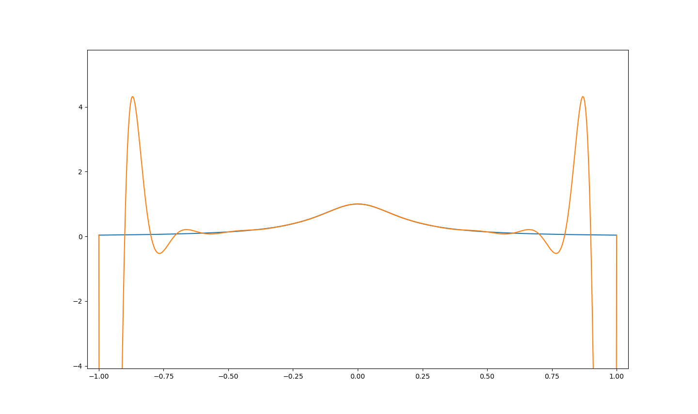
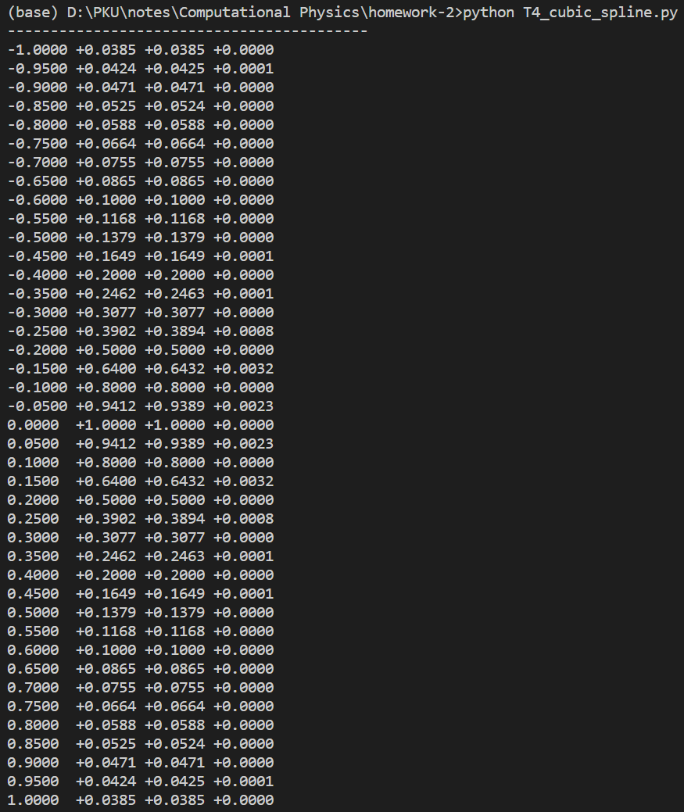

[作业解答pdf](./%E4%BD%9C%E4%B8%9A%E8%A7%A3%E7%AD%94.pdf)

# 第二次作业解答

## 1.Cholesky 消元法解方程组

第一题复用了作业一中的[matrixCalc.py](./matrixCalc.py)，得到的结果如下：

其中下方分别是通过GEM和Cholesky方法得到的方程组的解。注意到由于浮点数精度问题，得到的解并不严格等于1，而是存在很小的误差。

## 2.三次样条插值

设$f(x)=\cos(x^2)$，设$[x_0,x_1]$与$[x_1,x_2]$两端的三次样条函数分别为：

$$
\hat f(x) = \left\{\begin{matrix}
a_1(x-x_0)^3+b_1(x-x_0)^2+c_1(x-x_0)+d_1&x\in [x_0,x_1]\\
a_2(x-x_1)^3+b_2(x-x_1)^2+c_2(x-x_1)+d_2&x\in[x_1,x_2]\\
\end{matrix}\right.
$$

### (a) 已知端点二阶导数为零

可以列出约束方程：

$$
\hat f''(x_0)=\hat f''(x_2)=0\\
\hat f''(x_1+0)=\hat f''(x_1-0)\\
\hat f'(x_1+0)=\hat f'(x_1-0)\\
\hat f(x_0)=f(x_0)\\
\hat f(x_1-0)=\hat f(x_1+0)=f(x_1)\\ 
\hat f(x_2)=f(x_2)
$$

得到：

$$
b_1 = 0\\
6a_2h_1+2b_2 = 0\\ 
6a_1h_0+2b_1=2b_2\\
3a_1h_0^2+2b_1h_0+c_1=c_2 \\ 
d_1=f(x_0)\\ 
a_1h_0^3+b_1h_0^2+c_1h_0+d_1=f(x_1)\\ 
d_2=f(x_1)\\
a_2h_1^3+b_2h_1^2+c_2h_1+d_2=f(x_2)\\
$$

其中

$$
h_i = x_{i+1}-x_i
$$

为步长，

化简得到：

$$
b_1=0\\
d_1=f(x_0)\\
d_2=f(x_1)\\
a_1=\frac{b_2}{3h_0}\\
a_2 = -\frac{b_2}{3h_1}\\ 
\frac{b_2h_0^2}{3}+c_1h_0=f(x_1)-f(x_0)\\ 
\frac{-b_2}{3}h_1^2+b_2h_1^2+c_2h_1=f(x_2)-f(x_1)\\
b_2h_0+c_1=c_2
$$

解方程组，并将$f(x_i)$简记为

$$
y_i=f(x_i)
$$

得到：

$$
b_2=\frac{- 3 h_{0} y_{1} + 3 h_{0} y_{2} + 3 h_{1} y_{0} - 3 h_{1} y_{1}}{2 h_{0}^{2} h_{1} + 3 h_{0} h_{1}^{2} - h_{1}^{3}}\\ 
c_1=\frac{h_{0}^{3} y_{1} - h_{0}^{3} y_{2} - 3 h_{0}^{2} h_{1} y_{0} + 3 h_{0}^{2} h_{1} y_{1} - 3 h_{0} h_{1}^{2} y_{0} + 3 h_{0} h_{1}^{2} y_{1} + h_{1}^{3} y_{0} - h_{1}^{3} y_{1}}{2 h_{0}^{3} h_{1} + 3 h_{0}^{2} h_{1}^{2} - h_{0} h_{1}^{3}}\\
c_2=\frac{- 2 h_{0}^{3} y_{1} + 2 h_{0}^{3} y_{2} - 3 h_{0} h_{1}^{2} y_{0} + 3 h_{0} h_{1}^{2} y_{1} + h_{1}^{3} y_{0} - h_{1}^{3} y_{1}}{2 h_{0}^{3} h_{1} + 3 h_{0}^{2} h_{1}^{2} - h_{0} h_{1}^{3}}
$$

代入数值计算得到(见[T2.ipynb](./T2.ipynb))：

$$
b_2=-1.19082\\
c_1=0.13132\\
c_2=-0.58316\\
b_1=0.00000\\
d_1=1.00000\\
d_2=0.93590\\
a_1=-0.66156\\
a_2=1.32313\\
$$

### (b) 已知端点一阶导数

与上面的方程相比，该种情形下的约束方程只需要替换前两个式子即可：

$$
\hat f'(x_0)=f'(x_0)\\
\hat f'(x_2)=f'(x_2)\\
\hat f''(x_1+0)=\hat f''(x_1-0)\\
\hat f'(x_1+0)=\hat f'(x_1-0)\\
\hat f(x_0)=f(x_0)\\
\hat f(x_1-0)=\hat f(x_1+0)=f(x_1)\\ 
\hat f(x_2)=f(x_2)
$$

得到：

$$
c_1-t_0=0\\
3a_2h_1^2+2b_2h_1+c_2-t_2=0\\
6a_1h_0+2b_1=2b_2\\
3a_1h_0^2+2b_1h_0+c_1=c_2 \\ 
d_1=f(x_0)\\ 
a_1h_0^3+b_1h_0^2+c_1h_0+d_1=f(x_1)\\ 
d_2=f(x_1)\\
a_2h_1^3+b_2h_1^2+c_2h_1+d_2=f(x_2)\\
$$

其中

$$
t_0 = f'(0)=-2x\sin x^2|_{x=0}=0\\ 
t_2 = f'(0.9)\approx-1.30372
$$

$$
a_1=-0.62916\\
a_2=-1.12487\\
b_1=0.19943\\
b_2=-0.93305\\
c_1=0.00000\\
c_2=-0.44017\\
d_1=1.00000\\
d_2=0.93590\\
$$

通过画图比较可知，第二种的拟合效果要更好。

## 3.Chebyshev多项式展开

展开过程：首先将$\log_2(x),x\in [1,2]$转换为$[0,1]$之间的函数：通过变量代换:$x'=2\frac{x-1}{2-1}-1=2x-3$，得到新的函数为：

$$
f(x')=f_0(x)=\log_2 \frac{x'+3} 2
$$

$f(x')=\sum_{n=0}^\infty c_nT_n(x')$，根据正交归一条件得到系数$c_n$为:

$$
c_n = \int_{-1}^1 \log_2 \frac{x'+3}{2} \frac{T_n(x')}{\sqrt{1-x'^2}}dx'\frac{1}{\frac \pi 2 (1+\delta_{n0})}
$$

作代换：$x'=\cos \theta$，由$T_n(x)=\cos n\arccos x$,

$$
c_n=\int_0^\pi f(\cos \theta)\cos n\theta d\theta \frac {(1-\delta_{n0})} \pi
$$

取上式的离散近似，并截断求和为N项：$\theta_k = \frac{\pi (k+1/2)}{N}$,$\Delta \theta_k = \pi /N$

$$
c_n\approx c_{n,N}=\frac{2-\delta_{0m}}{N}\sum_{k=0}^{N-1}f(\cos \frac{\pi(k+1/2)}{N})\cos{m\pi\frac{k+1/2}{N}}
$$

取0-4阶进行比较作图，可以看到二者的曲线十分接近：

作差分析误差，可以看到误差在$\sim 10^{-5}$量级，而且在0两侧接近对称分布：

对0-6阶进行同样的分析，得到的误差将变得更小：

## 4.Runge效应

### a. Lagrange插值

通过拉格朗日插值法得到$P_{20}(x)$，作图得到：

拉格朗日插值法在插值区域中心处近似比较好，但在两端会出现剧烈震荡。

做表格如下所示：

### b. Chebyshev多项式插值

进行Chebyshev多项式插值，得到的结果如下图所示：

计算二者差的绝对值，作图得到：

或用数据表表示：

可以看到，切比雪夫近似在$x=0$附近的误差最大，相对误差远小于拉格朗日插值近似

### c. 三次样条函数插值

编写三次样条插值程序[spline_interpolation.py](./Spline_Interpolation.py)和自动测试程序[autotest.py](./autotest.py)，得到三次样条函数插值曲线（由于该种插值方法与原函数贴合紧密，无法看出区别，故只作出二者绝对值随x变化）：

数据表：

图像：

可以看到，二者最大误差在$0.003$左右，是切比雪夫多项式的拟合最大误差的$1/10$。

## 5. 样条函数在计算机绘图中的应用

### (a)

选取$t=0,1,2,\cdots,8$,  给出$x_t = r(\phi)\cos \phi$和$y_t=r(\phi)\sin\phi$的数值。将数值作为精确的数值列到一个表中。

| $t$ | $x_t$                                                      | $y_t$                                                          |
| -- | -- | -- |
| 0     | 0                                                            | 0                                                            |
| 1     | $\frac{\sqrt{2} \left(1 - \frac{\sqrt{2}}{2}\right)}{2}$   | $\frac{\sqrt{2} \left(1 - \frac{\sqrt{2}}{2}\right)}{2}$   |
| 2     | 0                                                            | 1                                                            |
| 3     | $- \frac{\sqrt{2} \left(\frac{\sqrt{2}}{2} + 1\right)}{2}$ | $\frac{\sqrt{2} \left(\frac{\sqrt{2}}{2} + 1\right)}{2}$   |
| 4     | -2                                                           | 0                                                            |
| 5     | $- \frac{\sqrt{2} \left(\frac{\sqrt{2}}{2} + 1\right)}{2}$ | $\frac{\sqrt{2} \left(\frac{\sqrt{2}}{2} + 1\right)}{2}$   |
| 6     | 0                                                            | -1                                                           |
| 7     | $\frac{\sqrt{2} \left(1 - \frac{\sqrt{2}}{2}\right)}{2} $  | $- \frac{\sqrt{2} \left(1 - \frac{\sqrt{2}}{2}\right)}{2}$ |

### b)给出三次样条函数$S_{\Delta}(X;t)$和$S_{\Delta}(Y;t)$

两个样条函数的表达式比较繁琐，各段的系数$a,b,c,d$请通过运行[T5.ipynb](./T5.ipynb)获得，从而可以写出其分段表达式：

$$
S_{\Delta}(X,t)=a_t+b_t(x-x_t)+c_t(x-x_t)^2+d_t(x-x_t)^3，x\in[x_t,x_{t+1}]
$$

$$
S_{\Delta}(Y,t)=a_t+b_t(y-y_t)+c_t(y-y_t)^2+d_t(y-y_t)^3，y\in[y_t,y_{t+1}]
$$

### (c)画出曲线，比较

作图如下所示。插值点已经在图中标出。

### (d)

该算法可以平滑连接所有点，是因为在该算法中，x和y都是关于参数t的三次样条插值函数，三次样条插值是二阶导数连续的，因此当参数t连续变化时，它们形成的点$(x(t),y(t))$也将构成一条平滑曲线。
